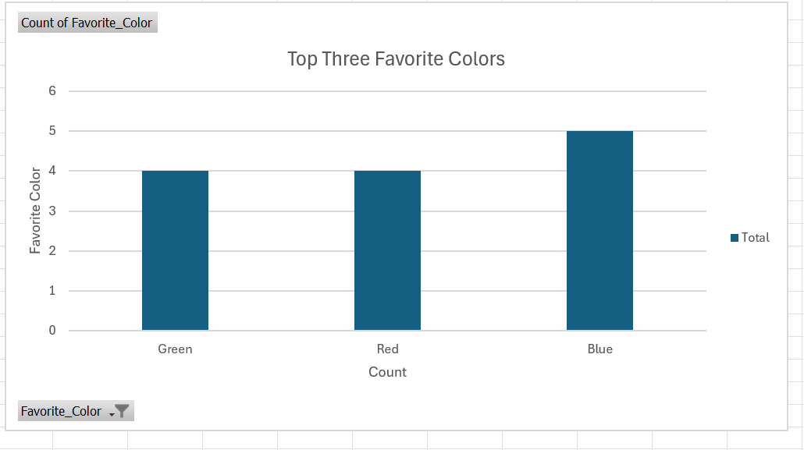
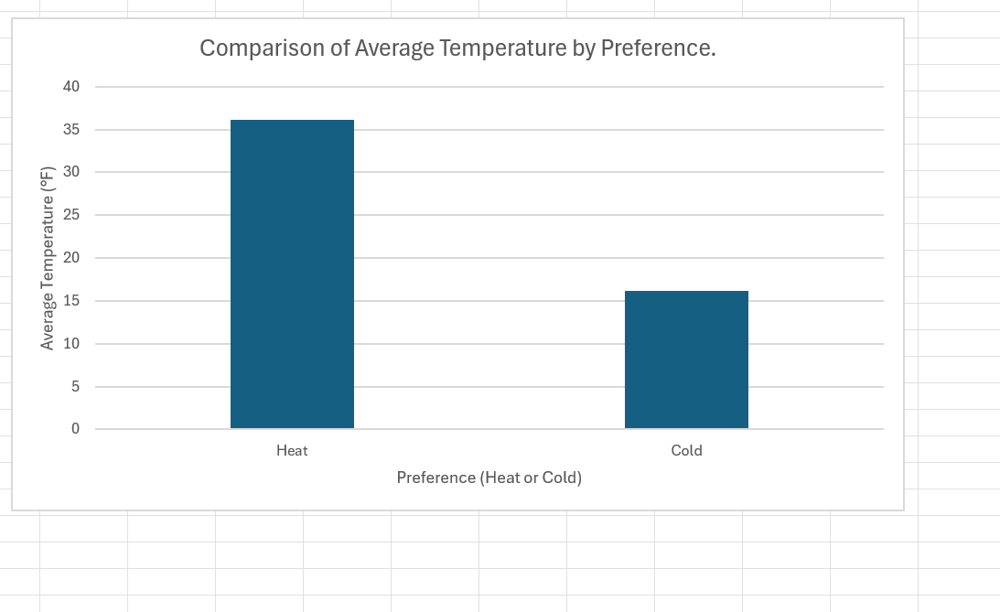
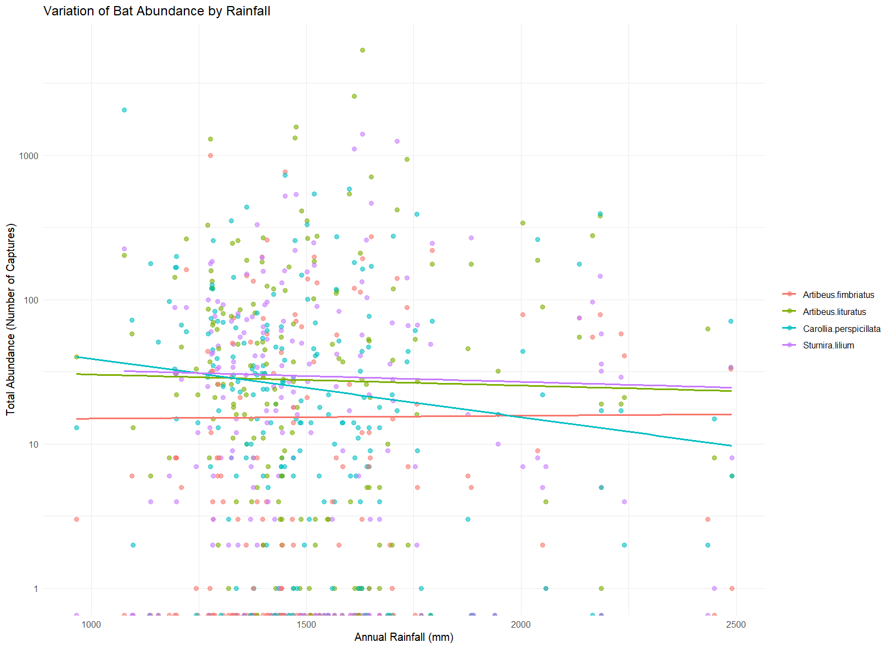
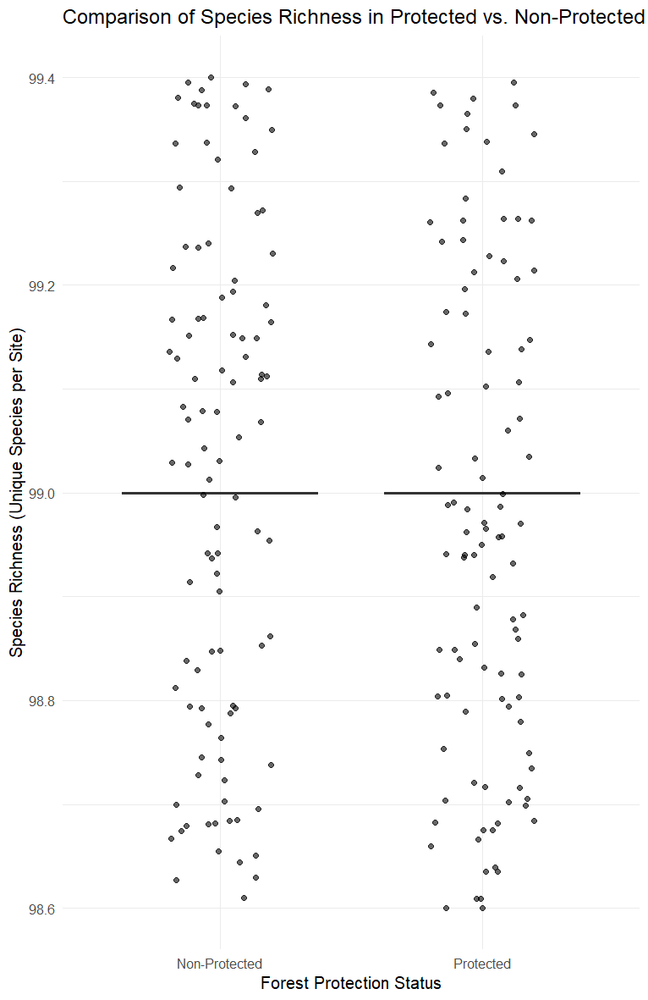

# Quantitative Methods in Conservation & Ecology — Research Poster

> Coursework project from **BIO 411: Quant Methods in Conserv & Eco (2025 Spring A)** (2025 Spring A).

**Course:** BIO 411: Quant Methods in Conserv & Eco (2025 Spring A) — 2025 Spring A  ·  **Area:** research, data

## Overview
This repository contains my submitted deliverables for the project below. The course assignment brief (verbatim, abbreviated):

> Module 6 – Communicating with Scientific Posters (20 points, further details below) Create a poster that outlines the work you have done for the project thus far. You should be able to use elements for all your check-in assignments thus far so that you do not have to create the entire assignment from scratch. Introduction (3 points): One to two paragraphs (paragraphs should be no more than 5 sentences. You can also use a series of bullet points) that give background information about both the data you are using as well as the question you are asking. Why is this question important and or relevant to the field of ecology and/or conservation biology? Methods (5 points): A detailed explanation 

## Tools & Tech
- PDF report
- R
- R Markdown

## Repository Structure
```
docs/BIO411Poster.pptx_4_-1.pdf
docs/BIO411Poster.pptx_4_.pdf
docs/Elsaady_Project-1-1-1.html
docs/FinalProject_BIO410-1_1_.html
docs/Module-3-Section-4-Questions.html
docs/Module-4-Overview-Student-Script.html
docs/Module2_Section1_Elsaady_Output-1.txt
docs/Module2_Section_2_Elsaady_Output.txt
docs/Module5FINAL-1.html
docs/SaifEModule-3-Overview-Assessment--1-.html
images/Abundancedbyhabitat.png
images/DiversityOT.png
images/TOP3COLORSEXCEL.png
images/abundancebyrainfall.png
images/average_temp.png
images/speciesrichness.png
src/Elsaady_Project_1-1-1.Rmd
src/FinalProject_BIO410-1_1_.Rmd
src/Module2_Section1_Elsaady-1.R
src/Module2_Section_2_Elsaady.R
src/Module5FINAL-1.Rmd
src/Module_2_Section_3_Script.R
src/Module_3_Section_4_Questions.Rmd
src/Module_4_Overview_Student_Script.Rmd
src/SaifEModule_3_Overview_Assessment_1_.Rmd
```

## Exploring the Code
- R / R Markdown sources are in `src/`.
- _Not independently re-run here; provided as submitted._

## Results
See the report(s)/presentation(s) in `docs/` — e.g. `docs/BIO411Poster.pptx_4_.pdf`.

## Preview





## License
Released under the MIT License — see `LICENSE`.

---
_Part of my engineering coursework portfolio. Deliverables only; routine homework, quizzes, and exams are intentionally excluded._